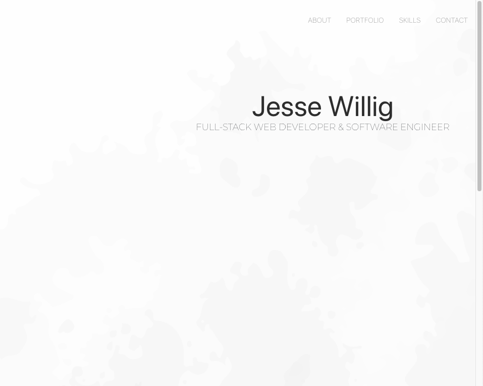
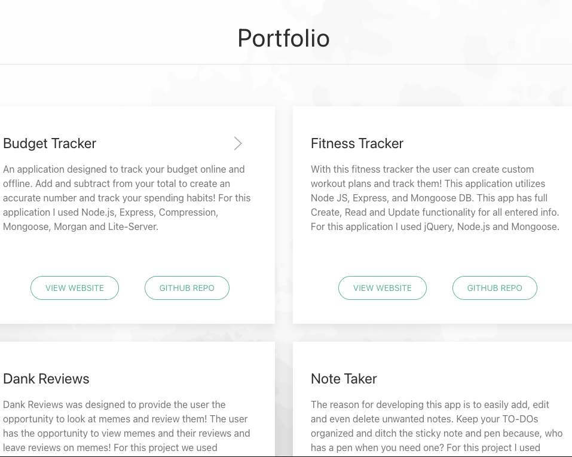
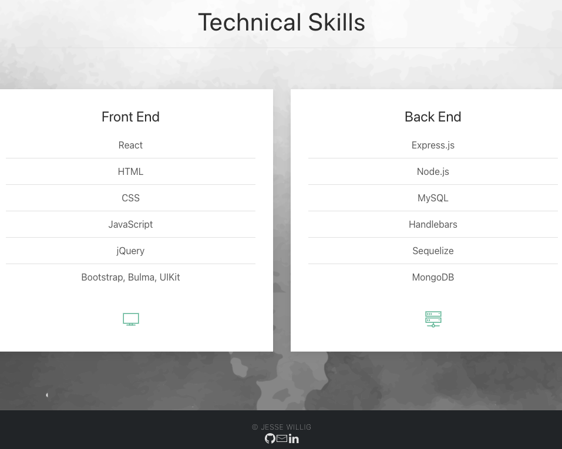

# [React Portfolio]()

## Description

 

 

## Technologies Used
* React
* [UIKit](https://getuikit.com/)
* JavaScript
* [Animate.css](https://animate.style/)

## Deployed application
View deployed site [here]().  

<!-- add git of deployed portfolio walk through -->

## Authors

* **Jesse Willig** - *Initial work* - [jessewillig](https://github.com/jessewillig)
* [jessewillig@outlook.com](mailto:jessewillig@outlook.com)